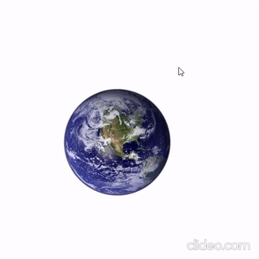

# floating-object
Floating object liberary that changes the position of an element based on the cursor position that makes floating interactive animation effect.


## Demo
 [Online Demo](https://codepen.io/babakzy/pen/xxyVQNO)



## 1. Install
run this command
```bash
npm install floating-object
```

## 2. import 
import the package in your project

Add CSS to you HTML
```html
<link rel="stylesheet" href="./node_modules/floating-object/floating.css">
```

Add JavaScript to you HTML
```html
<script src="./node_modules/floating-object/index.js"></script>
```

## 3. Add ID for floating Object
add "floating-container" for parent and "floating-object" for floating object in your HTML
```html
<div id="floating-container">
	
</div>	
```
*floating-container is a 100vw * 100vh ID which specifies the mouse interactive area. you can make it smaller but the best performance is when it's full width an height.

## 4. Apply floating effect on an object 
Use this function
floating-container: it is ID of parent element of floating object
floating-object:it is ID of floating object
120: it is coefficient value that effects on object movement for example here the object will floats(moves) maximum 120px based on mouse position
```javascript
floating('floating-container' , 'floating-object',120);
```

